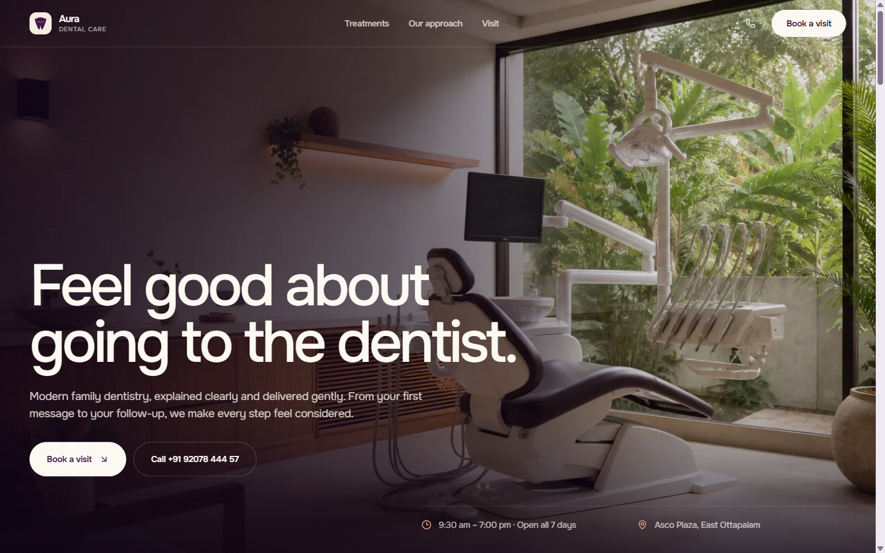
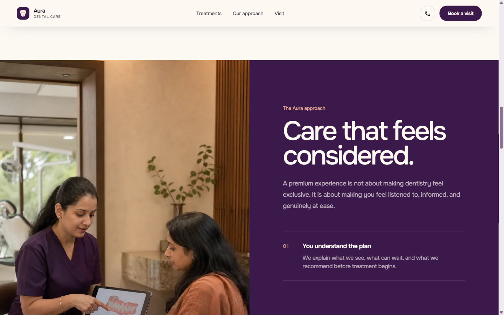
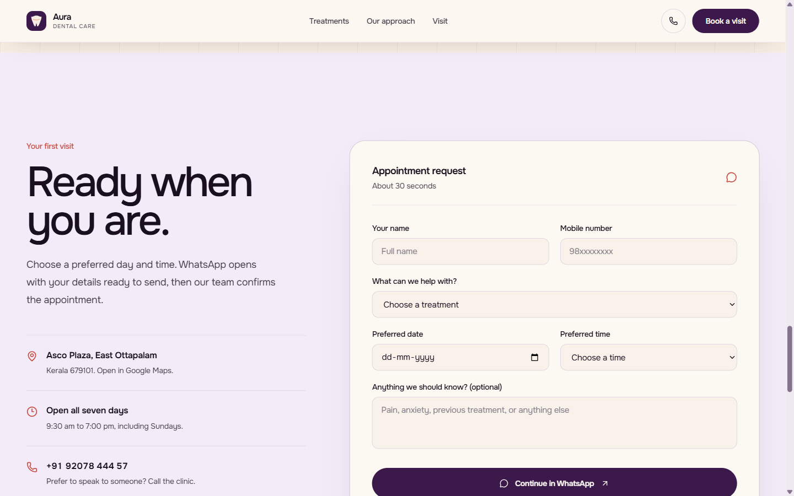
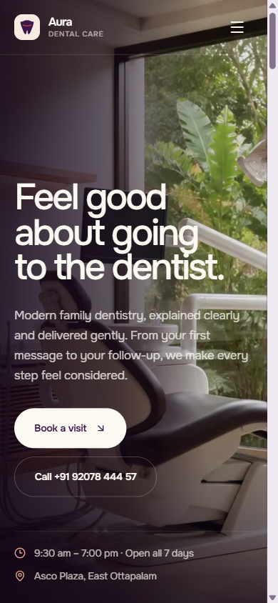
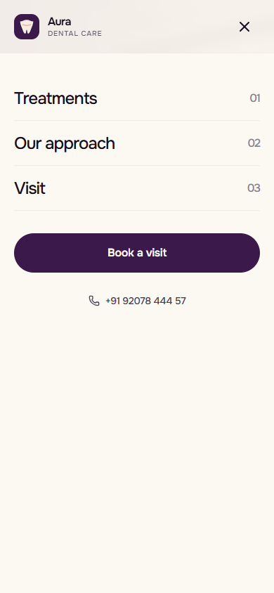

<h1 align="center">Aura Dental Care</h1>

<p align="center">
  <strong>A premium, conversion-focused clinic experience designed to make dentistry feel calmer, clearer, and easier to book.</strong>
</p>

<p align="center">
  <a href="https://dental-clinic-eta-two.vercel.app/">
    
  </a>
  <a href="https://github.com/deepakpk-dev/dental-clinic">
    
  </a>
</p>

<p align="center">
  
  
  
  
  
</p>

<a href="https://dental-clinic-eta-two.vercel.app/">
  
</a>

## Project overview

Aura Dental Care is an end-to-end frontend design and development project for a modern dental clinic in Ottapalam, Kerala. The brief was not simply to make healthcare look expensive. It was to make a potentially anxious decision feel trustworthy, local, and low-friction.

I shaped the product strategy, visual direction, responsive interface, interaction model, booking journey, accessibility behavior, and production implementation.

| | |
|---|---|
| **Role** | Product design · UI direction · Frontend development · Responsive QA |
| **Primary goal** | Turn patient confidence into appointment requests without pressure |
| **Audience** | Local patients and families comparing clinics, primarily on mobile |
| **Status** | Production deployment with responsive, route-level experiences |
| **Live site** | [dental-clinic-eta-two.vercel.app](https://dental-clinic-eta-two.vercel.app/) |

## What makes it stand out

- **Editorial art direction with a healthcare purpose.** Warm photography, restrained color, generous typography, and quiet motion communicate modern care without falling into the usual white-and-teal clinic template.
- **A conversion path that feels human.** Treatments build understanding, the approach section reduces anxiety, and the booking form moves naturally into WhatsApp—the clinic's fastest real-world confirmation channel.
- **Mobile is a first-class experience.** Navigation, typography, anchors, touch targets, booking controls, and content order were designed and visually verified for narrow screens.
- **Accessibility is part of the interaction design.** Semantic landmarks, descriptive labels, keyboard-safe navigation, focus containment, reduced-motion support, visible focus states, and appropriately sized controls are built in.
- **The interface is backed by a system.** Shared tokens, components, clinic data, service definitions, and validation rules keep the experience consistent across every route.

## Selected interface moments

### Reassurance before persuasion

The split-screen approach section pairs a calm consultation moment with plain-language principles. It establishes trust before asking the visitor to act.



### Booking without backend friction

The appointment request is deliberately short. React Hook Form and Zod provide accessible validation, then the submitted details are formatted into a ready-to-send WhatsApp message for the clinic.



### Mobile, designed—not compressed

<table>
  <tr>
    <td width="50%" align="center"><strong>Immersive mobile hero</strong></td>
    <td width="50%" align="center"><strong>Keyboard-safe navigation</strong></td>
  </tr>
  <tr>
    <td></td>
    <td></td>
  </tr>
</table>

## Product journey

**Discover the clinic** → **Understand available care** → **Build confidence** → **Choose a preferred visit** → **Confirm through WhatsApp**

Every section has a defined job in that journey. Supporting routes for services, the clinic story, gallery, and contact details provide useful depth instead of acting as placeholder pages.

## Engineering highlights

- Next.js 16 App Router with React 19 and TypeScript
- Tailwind CSS 4 with reusable color, typography, spacing, radius, and shadow tokens
- Responsive images delivered through `next/image`
- React Hook Form + Zod validation with accessible inline errors
- WhatsApp appointment handoff generated from structured form data
- Route-aware navigation styling over light and dark surfaces
- Mobile menu with Escape handling, scroll lock, focus wrapping, and focus restoration
- Static metadata, sitemap, robots configuration, and local-business structured data
- Vercel Analytics and Speed Insights integration
- Centralized clinic details and treatment data for maintainable content updates
- AI-assisted concept imagery, art-directed and integrated as optimized production assets

## Quality bar

The production build has been checked across desktop and narrow mobile viewports, including 1440px, 390px, and 320px layouts. The visual QA pass covered navigation contrast, content wrapping, anchors, keyboard behavior, overflow, form controls, and route consistency.

```bash
npm run lint
npm run build
```

Both commands pass successfully.

## Run locally

```bash
git clone https://github.com/deepakpk-dev/dental-clinic.git
cd dental-clinic
npm install
npm run dev
```

Open [http://localhost:3000](http://localhost:3000).

## Project structure

```text
app/                    Routes, metadata, sitemap, robots, global styles
components/             Navigation, booking form, footer, shared UI
components/sections/    Homepage storytelling and conversion sections
lib/                    Clinic data, validation, WhatsApp utilities
public/images/          Optimized visual assets
output/playwright/      Curated live-deployment screenshots
```

---

<p align="center">
  <strong>Frontend craft should make the product feel obvious, not merely decorated.</strong><br />
  <a href="https://dental-clinic-eta-two.vercel.app/">Explore the live experience →</a>
</p>
